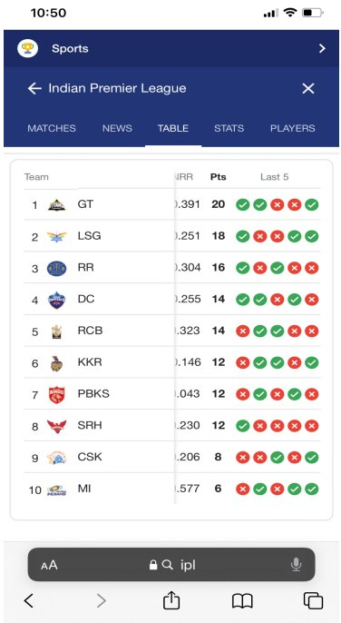

# Coding Assignment - Retrieving the consecutive winning/losing teams.

This Assignment done in javascript with help of nodejs and visual studio code.

## How to run this assignment
Firstly download  the [visual studio code](https://visualstudio.microsoft.com) from this website  and install it. Secondly download  the [nodejs](https://nodejs.org/en/download/) from this site  and install it. Open this code file with  visual studio code and run this in the terminal with the command *node file location address*

### Code
1. Created a small data structure that holds details - Name of the team, points they have earned and result of last 5 matches from below image that taken from TestVagrant Coding Assignment - Grads 2022.

```var iplTeam={ 
GT : {
nameOfTheTeam : "Gujarat Titans",
pointsEarned: 20,
resultOfLastMatch: ["W","W","L","L","W"],
},
LSG :{
nameOfTheTeam : "Lucknow Super Giants",
pointsEarned: 18,
resultOfLastMatch: ["W","L","L","W","W"]
},
RR : {
nameOfTheTeam : "Rajasthan Royals",
pointsEarned: 16,
resultOfLastMatch: ["W","L","W","L","L"],
},
DC : {
nameOfTheTeam : "Delhi Capitals",
pointsEarned: 14,
resultOfLastMatch: ["W","W","L","W","L"],
},
RCB : {
nameOfTheTeam : "Royal Challengers Banglore",
pointsEarned: 14,
resultOfLastMatch: ["L","W","W","L","L"],
},
KKR : {
nameOfTheTeam : "Kolkatha Knight Riders",
pointsEarned: 12,
resultOfLastMatch: ["L","W","W","L","W"],
},
PBKS : {
nameOfTheTeam : "Punjab Kings",
pointsEarned: 12,
resultOfLastMatch: ["L","W","L","W","L"],
},
SRH : {
nameOfTheTeam : "Sunrisers Hyderabad",
pointsEarned: 12,
resultOfLastMatch: ["W","L","L","L","L"],
},
CSK : {
nameOfTheTeam : "Chennai Super Kings",
pointsEarned: 8,
resultOfLastMatch: ["L","L","W","L","W"],
},
MI : {
nameOfTheTeam : "Mumbai Indians",
pointsEarned: 6,
resultOfLastMatch: ["L","W","L","W","W"],
}
}

var allTeams=[];
for (var key in iplTeam){
    allTeams.push(iplTeam[key]);
}
```


2. Programmatically retrieve the teams that have 2 consecutive losses here we check loss count and adding them to shortlist array

```
shortlist=[];

for(let i in allTeams){
    counts=consecutive(allTeams[i].resultOfLastMatch);
    if (counts>=1){
        counts+=1;
        shortlist.push(allTeams[i].nameOfTheTeam+": "+counts+" Losses");

    }
}
console.log(`These are the teams that have 2 consecutive losses:`,shortlist)
```

Here it will give consecutive losses count

```function consecutive(arr){
    var count=0;
    for (let i=0; i<arr.length-1;i++){
        
            if(arr[i]==arr[i+1]){
                if (arr[i]=='L'){count++}
                
            }
        
    }return count;

};
```


3. Generalizing the same solution, so that we could get teams that have n consecutive losses/wins

```var consecutiveWinTeams=[];
var consecutiveLossTeams=[];

function n_consecutive(arr){
    var countLose=0;
    var countWin=0;
    var counted;
    
    for (let i=0; i<arr.length;i++){
        {
            if(arr[i]==arr[i+1]){
                if (arr[i]==='L'){countLose++;}
                if (arr[i]==='W'){countWin++}
                
            }
        }
    }
    counted = [countLose,countWin]
    return counted;

};
for(let i in allTeams){
    var counted=n_consecutive(allTeams[i].resultOfLastMatch);
    var teamName=allTeams[i].nameOfTheTeam;
    if (counted[0]>0){
        consecutiveLossTeams.push(teamName)

    }
    if (counted[1]>0){
        consecutiveWinTeams.push(teamName)
    }
}

console.log(`these are the consecutive win teams: ${consecutiveWinTeams} ` )
console.log(`these are the consecutive loss teams: ${consecutiveLossTeams}` )
```


4. Calculating the average points of these filtered teams

```
var sum1=0;
var sum2=0;

// console.log(allTeams.map((e)=>{return e.nameOfTheTeam}).indexOf("Mumbai Indians"))
// console.log(allTeams[9].pointsEarned)
```

average points of consecutiveWinTeams
```
for (let i=0;i<consecutiveWinTeams.length;i++){var index =allTeams.map((e)=>{return e.nameOfTheTeam}).indexOf(consecutiveWinTeams[i])
let value = allTeams[index].pointsEarned;
sum1=sum1+value;

}
console.log(sum1/consecutiveWinTeams.length) 
```

average points of consecutiveLoseTeams
```
for (let i=0;i<consecutiveLossTeams.length;i++){var index =allTeams.map((e)=>{return e.nameOfTheTeam}).indexOf(consecutiveLossTeams[i])
let value = allTeams[index].pointsEarned;
sum2=sum2+value;
}
console.log(Math.floor(sum2/consecutiveLossTeams.length))
```    
